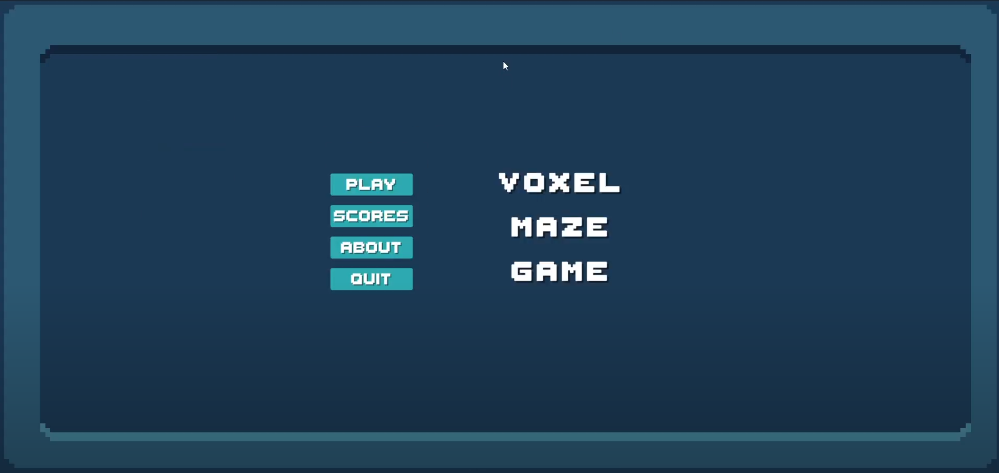

# Voxel Maze FPS

### Introduction

The aim of the project is to create an entertaining and aesthetically-pleasing fps game with voxel-like destruction. The game’s objective is to collect a certain number of “key” items in order to unlock the “treasure” goal, while collecting as many points as possible. Unlocking the treasure will trigger a “game clear” event. The player is placed in a randomly generated maze and must search for the missing keys while fending against enemies. The player must complete his task of collecting all keys and unlocking the treasure before a timer runs out. The player can destroy certain walls in order to traverse the maze quickly and evade enemies.

### Demo

